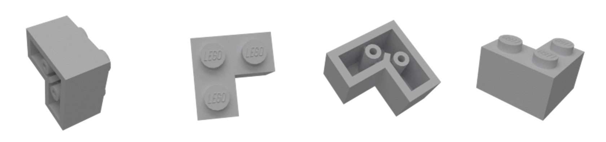
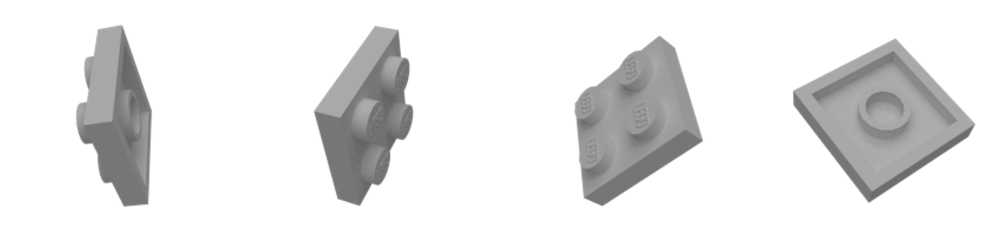
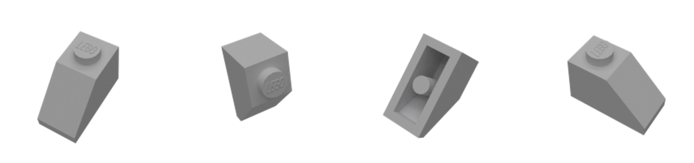

How to use my awesome Deep Learning library:
==============================================
Documentation:
---------------
The Documentation can be found in the docs folder.

It contains:

 - the doxygen-config File
- a pdf Documentation, explainin the Top-level concepts
 -  a ready compiled doxygen documentation

Python Bindings:
-----------------
In order to use the python Bindings one most build the target 'libdl'.
In the next step one can then import libdl into a python script as follows:
```python
import sys
pathBuildDir = 'path/to/your/build/directory/'

sys.path.append(pathBuildDir+'library/bindings')


import libdl as dl
```
Problems that may Occur
---------------------------
in the Top Level CMakeLists.txt -march=native is set as CXX Flag, this causes problems for some processors resulting in SIGSEVs


Example Applications:
=====================

Project: LEGO Bricks Classification:
----------------------------
The Project aimed, to classify 16 different types of LEGO Bricks.
For each Lego Brick Type there exist around 400 images showing the brick from a different angle
e.g.:

Label: 2357-Brick corner 1x2x2:

Label: 3022-Plate 2x2

Label: 3040 Roof Tile 1x2x45deg

Label: 6632 Technic Lever 3M


There are in total three examples that run a network on this data:

 - the presentation jupyter notebook in pythonApps/ :
    - mostly visualization and explanation
 - pythonApps/example_lego.py :
    - playground in python with comments in the file
    - a pretrained Network is set
 - example_LEGO.cpp :
    - similiar to the MNIST examples, comments on the parameters are in the beginning of main()
    - no pretrained network is set

Note: For the python examples please first apply the above provided instructions.

XOR Problem
-------------
The XOR problem is simulated in the build File Example_XOR, which is build from the Code in Example_XOR.cpp\
When executing, it uses the following Mini-batch where one data point is represented by one row:\
\
&nbsp;&nbsp;&nbsp;&nbsp;&nbsp;&nbsp;Eigen::MatrixXf mX1(4, 2);\
&nbsp;&nbsp;&nbsp;&nbsp;&nbsp;&nbsp;&nbsp;&nbsp;&nbsp;&nbsp;&nbsp;&nbsp;mX1 << 1, 0,\
&nbsp;&nbsp;&nbsp;&nbsp;&nbsp;&nbsp;&nbsp;&nbsp;&nbsp;&nbsp;&nbsp;&nbsp;&nbsp;&nbsp;&nbsp;&nbsp;&nbsp;&nbsp;&nbsp;&nbsp;&nbsp;&nbsp;&nbsp;&nbsp;&nbsp;0, 1,\
&nbsp;&nbsp;&nbsp;&nbsp;&nbsp;&nbsp;&nbsp;&nbsp;&nbsp;&nbsp;&nbsp;&nbsp;&nbsp;&nbsp;&nbsp;&nbsp;&nbsp;&nbsp;&nbsp;&nbsp;&nbsp;&nbsp;&nbsp;&nbsp;&nbsp;0, 0,\
&nbsp;&nbsp;&nbsp;&nbsp;&nbsp;&nbsp;&nbsp;&nbsp;&nbsp;&nbsp;&nbsp;&nbsp;&nbsp;&nbsp;&nbsp;&nbsp;&nbsp;&nbsp;&nbsp;&nbsp;&nbsp;&nbsp;&nbsp;&nbsp;&nbsp;1, 1;\
			\
with the Corresponding Classes stored in the Vector C\
\
&nbsp;&nbsp;&nbsp;&nbsp;&nbsp;&nbsp;Eigen::MatrixXf C(4, 1);\
&nbsp;&nbsp;&nbsp;&nbsp;&nbsp;&nbsp;&nbsp;&nbsp;&nbsp;&nbsp;&nbsp;&nbsp;C << 1,\
&nbsp;&nbsp;&nbsp;&nbsp;&nbsp;&nbsp;&nbsp;&nbsp;&nbsp;&nbsp;&nbsp;&nbsp;&nbsp;&nbsp;&nbsp;&nbsp;&nbsp;&nbsp;&nbsp;&nbsp;&nbsp;&nbsp;&nbsp;1,\
&nbsp;&nbsp;&nbsp;&nbsp;&nbsp;&nbsp;&nbsp;&nbsp;&nbsp;&nbsp;&nbsp;&nbsp;&nbsp;&nbsp;&nbsp;&nbsp;&nbsp;&nbsp;&nbsp;&nbsp;&nbsp;&nbsp;&nbsp;0,\
&nbsp;&nbsp;&nbsp;&nbsp;&nbsp;&nbsp;&nbsp;&nbsp;&nbsp;&nbsp;&nbsp;&nbsp;&nbsp;&nbsp;&nbsp;&nbsp;&nbsp;&nbsp;&nbsp;&nbsp;&nbsp;&nbsp;&nbsp;0;\
\
and randomly initialized Weights and Biases.\
\
As a output it gives the prediction and loss after 10 epochs with learning Rate 10.

# MNIST
The MNIST problem is simulated in the build File Example_MNIST, which is build from the Code in Example_MNIST.cpp\
The settings are predefined so that pre-learned weights are read from the Storage and are then used to predict a subset of the MNIST testset.

In order to train the Model, the settings at the beginning of the main method (in Example_MNIST.cpp) have to be changed. See inline Comments.


